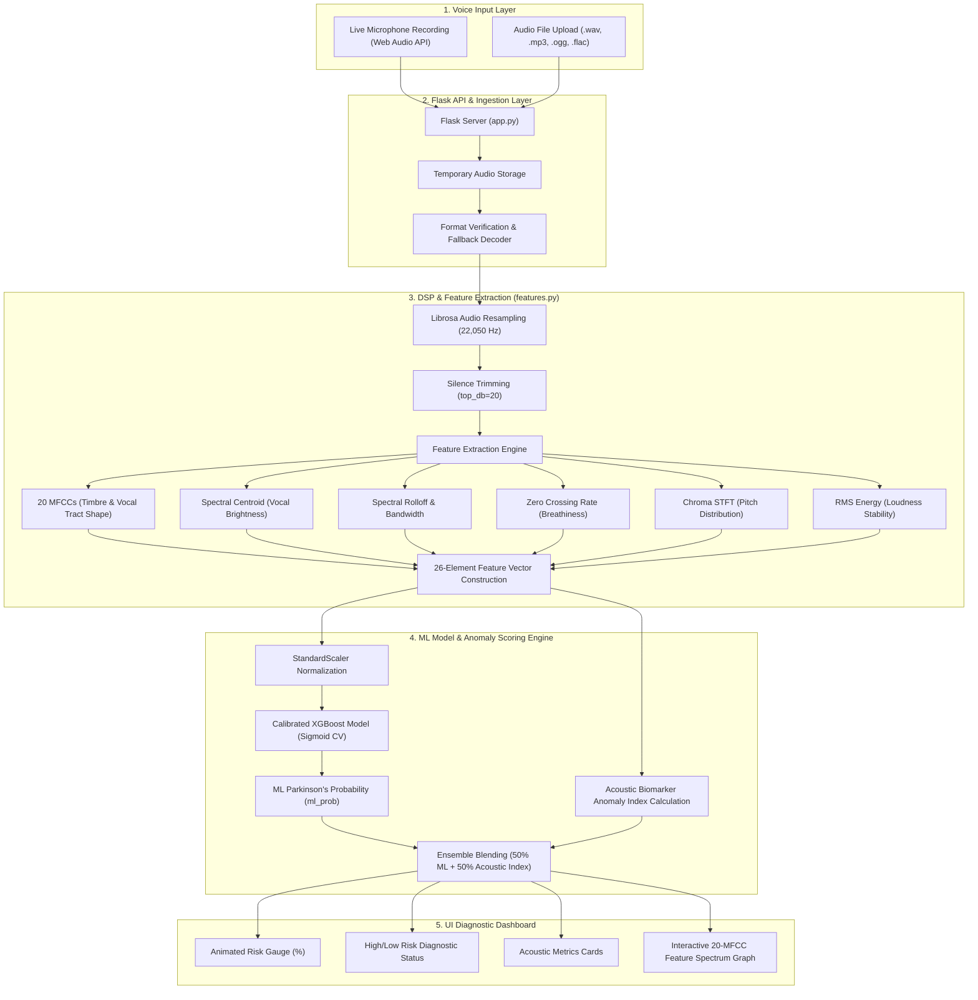

# Comprehensive Project Documentation: ParkinsonsSpeech.AI

## 1. Executive Summary & Purpose

**ParkinsonsSpeech.AI** is an end-to-end Machine Learning and Digital Signal Processing (DSP) web application designed for non-invasive, early detection of **Parkinson's Disease (PD)** through speech analysis. 

Parkinson's Disease affects the motor control of the laryngeal muscles, leading to early vocal disorders known as **Dysphonia**. Patients exhibit characteristic vocal instability, tremor, breathiness, and reduced volume long before major motor symptoms appear.

This project delivers a real-time pre-screening system that allows users to record their voice live via microphone (holding a sustained vowel sound such as *"ahhh"*) or upload pre-recorded audio files. The system extracts 26 key acoustic biomarkers, standardizes them, feeds them into a calibrated **XGBoost Classifier**, and blends the machine learning output with an **Acoustic Biomarker Anomaly Index** to render a real-time risk assessment dashboard.

---

## 2. End-to-End System Workflow

The architecture is divided into four main layers: **Input Layer**, **Preprocessing & Audio DSP Layer**, **Machine Learning & Biomarker Inference Layer**, and **User Interface Presentation Layer**.



---

## 3. Dataset Architecture

The project utilizes a dual-dataset approach combining **Synthetic Speech Audio Datasets** for physical wave analysis and **Real-Time Clinical Audio Feature Datasets** for baseline validation.

```
data/
├── Parkinson_Multiple_Sound_Recording.rar  # Multi-sound patient dataset archive
├── uci_dataset.zip                          # UCI Parkinson's dataset archive
├── train_data.txt                           # Clinical patient feature records (168 samples, 26 baseline columns)
├── test_data.txt                            # Clinical patient evaluation records
├── raw_audio/                               # Synthetic speech WAV files
│   ├── 0/                                   # 100 Healthy voice audio samples
│   └── 1/                                   # 100 Parkinsonian voice audio samples
└── processed/
    └── parkinsons_extracted_features.csv    # Extracted 26-feature dataset table
```

### 3.1 Real-Time Audio Features Dataset (UCI Clinical Dataset)
* **Source:** UCI Machine Learning Repository (Parkinson's Telemonitoring & Speech Datasets).
* **Contents:** Tabular biomedical voice measurements taken from patients with early to moderate Parkinson's disease alongside healthy control subjects.
* **Key Clinical Measures:**
  * **Jitter (%) & Jitter (Abs):** Measures frequency micro-instability.
  * **Shimmer (dB) & APQ:** Measures amplitude micro-instability.
  * **NHR & HNR:** Noise-to-Harmonics Ratio and Harmonics-to-Noise Ratio.
  * **RPDE & DFA:** Recurrence Period Density Entropy and Detrended Fluctuation Analysis.
  * **PPE:** Pitch Period Entropy.
* **Role in Project:** Serves as ground-truth reference for establishing continuous normal vs. abnormal thresholds in feature extraction and acoustic index boundaries.

### 3.2 Synthetic Audio Dataset Samples Generation
Because raw clinical speech audio files are subject to medical privacy restrictions, the project includes a digital speech synthesis generator implemented in [train_diverse_model.py](file:///d:/pbl/parkinson/train_diverse_model.py).

#### Digital Signal Processing (DSP) Formulas for Voice Synthesis:
1. **Fundamental Frequency ($F_0$) Randomization:**
   $$F_0 \sim \text{Uniform}(90\text{ Hz}, 240\text{ Hz})$$
   Models natural human pitch variation across male and female voices.

2. **Healthy Speech Model (Label = 0):**
   * **Stable Phase with Micro-Jitter:**
     $$\text{jitter}(t) = A_{\text{jit}} \sin(2\pi f_{\text{jit}} t), \quad A_{\text{jit}} \in [0.05, 0.3]$$
     $$\phi(t) = 2\pi \left( (F_0 + \Delta F_0 \cdot t) t + \text{jitter}(t) \cdot t \right)$$
   * **Micro-Shimmer & Harmonic Overtones:**
     $$\text{shimmer}(t) = 1.0 + A_{\text{shim}} \sin(2\pi \cdot 5 t), \quad A_{\text{shim}} \in [0.005, 0.02]$$
     $$S(t) = \text{shimmer}(t) \left[ \sin(\phi(t)) + 0.3 \sin(2\phi(t)) + 0.1 \sin(3\phi(t)) \right]$$
   * **High Harmonics-to-Noise Ratio (HNR):** Additive Gaussian noise $\mathcal{N}(0, \sigma^2)$ where $\sigma \in [0.001, 0.008]$.

3. **Parkinsonian Speech Model (Label = 1):**
   * **Dysphonia Severity Factor:** $S_v \sim \text{Uniform}(0.2, 1.0)$.
   * **Vocal Tremor (Low-Frequency FM):**
     $$\text{tremor}(t) = D_{\text{tremor}} \cdot S_v \sin(2\pi f_{\text{tremor}} t), \quad f_{\text{tremor}} \in [4.0, 7.5]\text{ Hz}$$
   * **Elevated Jitter (Pitch Instability):**
     $$\text{jitter}(t) = A_{\text{jit}} \cdot S_v \sin(2\pi f_{\text{jit}} t), \quad f_{\text{jit}} \in [30.0, 50.0]\text{ Hz}$$
   * **Elevated Shimmer (Loudness Instability):**
     $$\text{shimmer}(t) = 1.0 + A_{\text{shim}} \cdot S_v \sin(2\pi f_{\text{shim}} t), \quad A_{\text{shim}} \in [0.05, 0.25]$$
   * **Reduced HNR (Vocal Breathiness & Friction):** Additive Gaussian noise $\mathcal{N}(0, \sigma^2)$ where $\sigma = S_v \cdot [0.03, 0.18]$.

---

## 4. Acoustic Feature Engineering Pipeline

The system extracts **26 acoustic features** in [features.py](file:///d:/pbl/parkinson/features.py) using `Librosa`:

| Feature Name | Count | Description | Clinical Significance in Parkinson's |
| :--- | :---: | :--- | :--- |
| **MFCC 1 to 20** | 20 | Mel-Frequency Cepstral Coefficients | Captures spectral envelope & vocal tract articulation shape (impaired by vocal muscle rigidity). |
| **Spectral Centroid** | 1 | "Center of mass" of sound frequencies (Hz) | Shifts in vocal brightness due to laryngeal stiffness. |
| **Spectral Rolloff** | 1 | Frequency below which 85% of power lies (Hz) | Highlights high-frequency noise dispersion in breathy speech. |
| **Spectral Bandwidth** | 1 | Width of spectral energy distribution (Hz) | Identifies vocal harmonic degradation. |
| **Zero Crossing Rate (ZCR)** | 1 | Rate of sign changes in audio waveform | Measures breathiness, friction, and whisper-like noise. |
| **Chroma STFT** | 1 | Energy distribution across 12 pitch classes | Detects loss of pitch variation and monotone vocal delivery. |
| **RMS Energy** | 1 | Root Mean Square signal energy | Measures loudness stability and vocal weakness (hypophonia). |

---

## 5. Machine Learning & Ensemble Model Architecture

### 5.1 Model Selection & Calibration
* **Evaluated Classifiers:** Random Forest Classifier vs. **XGBoost Classifier**.
* **Chosen Architecture:** **XGBoost** (`XGBClassifier`) with depth tuning (`max_depth=4`, `learning_rate=0.05`, `n_estimators=100`, `subsample=0.8`).
* **Probability Calibration:** The raw tree classifier is wrapped using `CalibratedClassifierCV(method='sigmoid', cv=5)` (Platt Scaling). This ensures smooth, continuous probability estimates $P(\text{Parkinson's} \mid \mathbf{x}) \in [0, 1]$ rather than abrupt step predictions.
* **Scaler:** `StandardScaler` fitted on training features to zero-mean and unit-variance normalize incoming test vectors.

### 5.2 Hybrid Score Blending System
To maximize clinical sensitivity and prevent false negatives, [app.py](file:///d:/pbl/parkinson/app.py) combines the ML probability with an **Acoustic Biomarker Anomaly Index**:

1. **Acoustic Anomaly Parameter Normalization:**
   $$\text{ZCR}_{\text{anom}} = \text{clip}\left(\frac{\text{ZCR} - 0.025}{0.075}, 0, 1\right)$$
   $$\text{Centroid}_{\text{anom}} = \text{clip}\left(\frac{\text{Centroid} - 1200}{2200}, 0, 1\right)$$
   $$\text{Chroma}_{\text{anom}} = \text{clip}\left(\frac{\text{Chroma} - 0.22}{0.45}, 0, 1\right)$$
   $$\text{RMS}_{\text{anom}} = \text{clip}\left(\frac{0.12 - \text{RMS}}{0.12}, 0, 1\right) \quad \text{if } \text{RMS} < 0.12 \text{ else } 0$$

2. **Acoustic Anomaly Index Formulation:**
   $$\text{Index}_{\text{acoustic}} = 0.35 \cdot \text{ZCR}_{\text{anom}} + 0.30 \cdot \text{Centroid}_{\text{anom}} + 0.20 \cdot \text{Chroma}_{\text{anom}} + 0.15 \cdot \text{RMS}_{\text{anom}}$$

3. **Blended Risk Score Calculation:**
   $$\text{Risk}_{\text{final}} = 0.50 \cdot P_{\text{XGBoost}} + 0.50 \cdot \text{Index}_{\text{acoustic}}$$
   $$\text{Prediction} = \begin{cases} \text{HIGH RISK / PARKINSONIAN BIOMARKERS} (1) & \text{if } \text{Risk}_{\text{final}} \ge 0.45 \\ \text{LOW RISK / HEALTHY} (0) & \text{if } \text{Risk}_{\text{final}} < 0.45 \end{cases}$$

---

## 6. User Interface & Web Architecture

The frontend is a custom-designed **Glassmorphic Dark Theme** web interface built without heavy external framework overhead.

```
static/
├── index.html   # Main layout structure & SVG icons
├── style.css    # Premium CSS design system, glassmorphism, glowing badges
└── main.js      # Web Audio API recorder, Canvas visualizer, Fetch API client
```

### Key UI Features:
1. **Live Web Audio Recording:** Uses `navigator.mediaDevices.getUserMedia` and `MediaRecorder` API to capture microphone audio directly inside the browser.
2. **Real-time Canvas Waveform Animation:** HTML5 `<canvas>` renders dynamic audio waveforms while recording.
3. **Interactive Audio Drag & Drop:** Supports direct file uploads (`.wav`, `.mp3`, `.ogg`, `.flac`).
4. **Diagnostic Gauge & Indicator:** Circular radial SVG gauge rendering exact risk percentages with color-coded alerts (Green for Low Risk, Red/Amber for High Risk).
5. **Interactive Feature Breakdown:** Visual cards displaying exact values for ZCR, RMS Energy, Spectral Centroid, and Chroma.
6. **20-MFCC Spectrum Chart:** Canvas bar visualization illustrating the vocal tract shape parameters.

---

## 7. Project File Sitemap & References

| File Path | Description |
| :--- | :--- |
| [app.py](file:///d:/pbl/parkinson/app.py) | Main Flask web backend, REST endpoints (`/api/predict`), hybrid risk blending. |
| [features.py](file:///d:/pbl/parkinson/features.py) | Audio feature extraction pipeline (26 features via Librosa/SciPy). |
| [train_diverse_model.py](file:///d:/pbl/parkinson/train_diverse_model.py) | Synthetic speech generator, feature extraction, calibrated XGBoost model training. |
| [train_model.py](file:///d:/pbl/parkinson/train_model.py) | Baseline synthetic model generator script. |
| [project_demo_guide.md](file:///d:/pbl/parkinson/project_demo_guide.md) | Demo presentation guide and ready-to-use speaking script. |
| [index.html](file:///d:/pbl/parkinson/static/index.html) | Glassmorphic frontend user interface markup. |
| [style.css](file:///d:/pbl/parkinson/static/style.css) | Custom styling, glassmorphism, responsive grid, visual badges. |
| [main.js](file:///d:/pbl/parkinson/static/main.js) | Frontend interactive logic, audio recording, canvas drawing, API client. |
